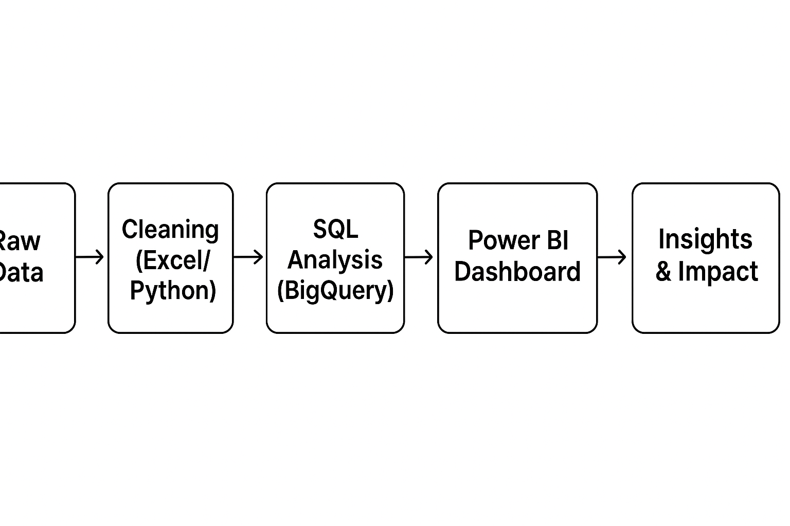

# 🌆 Urban Company Data Analytics Project 📊  

This project presents an **end-to-end data analytics solution** for **Urban Company**, leveraging **SQL, Power BI, Excel, and Python** to extract **business insights, performance trends, and strategic opportunities**.  

The analysis focuses on **service demand, cost structures, and city-wise growth potential**, enabling **data-driven decision-making** for revenue optimization and operational efficiency.  

---

## 🖼️ Project Workflow  

  
*Data pipeline: Raw Data → Cleaning (Excel/Python) → SQL Analysis → Power BI Dashboard → Insights & Impact*  

---

## 📊 Dashboard Preview  

  
.png)  
.png)  

*Interactive dashboard showing revenue by city, top subservices, and cost breakdown*  

---


## 🧩 Problem Statement  

Urban Company faces the challenge of optimizing **service efficiency and pricing strategy** across multiple cities. Key business questions addressed in this project:  

1. Which **cities and services** generate the highest revenue?  
2. What is the **labour vs. material cost structure** across service types?  
3. Where should the company **expand or introduce premium plans**?  
4. How can **technician efficiency** be improved in labour-heavy services?  

---

## 🛠️ Tools & Technologies  

| Tool / Tech      | Role in Project |
|------------------|-----------------|
| **Excel**        | Data cleaning, preprocessing |
| **SQL (BigQuery)** | Core analysis & business queries |
| **Power BI**     | Interactive dashboards, KPIs & storytelling |
| **Python**       | Data formatting & calculation helpers |

---

## 🚀 Approach  

1. **Data Preparation & Cleaning**  
   - Removed nulls, duplicates, and inconsistencies  
   - Converted text-based charges into numeric format  
   - Calculated derived metrics like `labour_to_total_pct`  

2. **SQL-Based Analytics**  
   - Revenue trends by city & service type  
   - Top subservices and high-labour-cost services  
   - City-level expansion potential  

3. **Power BI Dashboard**  
   - KPIs: Revenue, Avg. Service Charge, Labour-Heavy Count  
   - Dynamic visualizations with slicers, pie/bar charts, and tooltips  
   - Storytelling bookmarks for business presentations  

---

## 🔍 SQL Analysis & Business Insights  

All queries were executed in **BigQuery** (can run in any SQL engine). Below are the questions answered:  

### 1️⃣ Highest Avg. Total Service Charge by City  
```sql
SELECT city_name, ROUND(AVG(total_charge), 0) AS avg_total_charge
FROM urban_data
GROUP BY city_name
ORDER BY avg_total_charge DESC;
```
Insight: Lucknow tops with ₹1062 average service charge — potential for premium service expansion.

## 2️⃣ Top 10 Subservices by Total Revenue
```
SELECT subservice_name, SUM(total_charge) AS total_revenue
FROM urban_data
GROUP BY subservice_name
ORDER BY total_revenue DESC
LIMIT 10;
```
Insight: Compressor 2 ton repair leads with ₹3.95 Lakhs — high priority for promotion and technician specialization.

## 3️⃣ Service Types with Highest Labour % Cost
```
SELECT service_type, ROUND(AVG(labour_to_total_pct), 1) AS avg_labour_pct
FROM urban_data
GROUP BY service_type
ORDER BY avg_labour_pct DESC;
```
Insight: Microwave repairs have the highest labour share (38.4%) — improve training or automation.


## 4️⃣ Count of Labour-Heavy Services
```
SELECT COUNT(*) AS labour_heavy_services
FROM urban_data
WHERE labour_charge > material_charge;
```
Insight: 638 services are labour-heavy — opportunity to control cost via better technician workflows.

## 5️⃣ City-wise Total Revenue
```
SELECT city_name, SUM(total_charge) AS total_city_revenue
FROM urban_data
GROUP BY city_name
ORDER BY total_city_revenue DESC;
```

## 📊 Key Insights  

<span style="color:red">🔹 Revenue Drivers: Compressor 2 ton repair contributed ₹3.95 Lakhs – high-priority service for promotion.</span>  
<span style="color:red">🔹 Premium Potential: Lucknow leads with ₹1062 avg. service charge – scope for premium plan rollout.</span>  
<span style="color:red">🔹 High-Revenue Cities: Hyderabad, Pune, and Chennai crossed ₹1.7 Lakhs each – ideal for regional expansion.</span>  
<span style="color:red">🔹 Labour-Heavy Services: 638 services had higher labour cost than material – signalling need for technician efficiency improvements.</span>  
<span style="color:red">🔹 Cost Structure: Microwave repairs show highest labour share (38.4%) – focus on training or automation.</span>  

---

## 🌟 Business Impact  

<span style="color:red">✅ Data-Driven Expansion: Identified top-performing cities for scaling operations.</span>  
<span style="color:red">✅ Optimized Pricing Strategy: Recommendations for tiered (Basic–Standard–Premium) plans.</span>  
<span style="color:red">✅ Efficiency Boost: Highlighted labour-heavy services to streamline technician workflows.</span>  
<span style="color:red">✅ Targeted Promotions: Pinpointed high-revenue subservices for specialized marketing.</span>  
<span style="color:red">✅ Strategic Resource Allocation: Helped Urban Company align resources with revenue hotspots.</span>  


## 📦 Repository Contents

urban_company_cleaned.xlsx → Cleaned dataset

urban_insights.sql → SQL queries for analysis

dashboard.pbix → Power BI dashboard

README.md → Documentation

## 🔮 Future Enhancements

Integrate customer satisfaction ratings for quality analysis

Use Machine Learning to predict demand and seasonal trends

Deploy a real-time Power BI Service dashboard for leadership teams

## 👤 Author

Aditya Srivastava
📌 GitHub
 | LinkedIn


---

👉 Just place your **workflow diagram** (`workflow.png`) and **dashboard screenshot** (`dashboard.png`) inside an `assets/` folder in your repo.  
GitHub will automatically render them in the README.  

Would you like me to **design a clean workflow diagram (PNG)** for you, so you don’t have to make it yourself?


